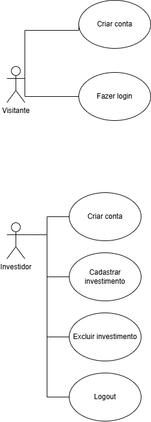
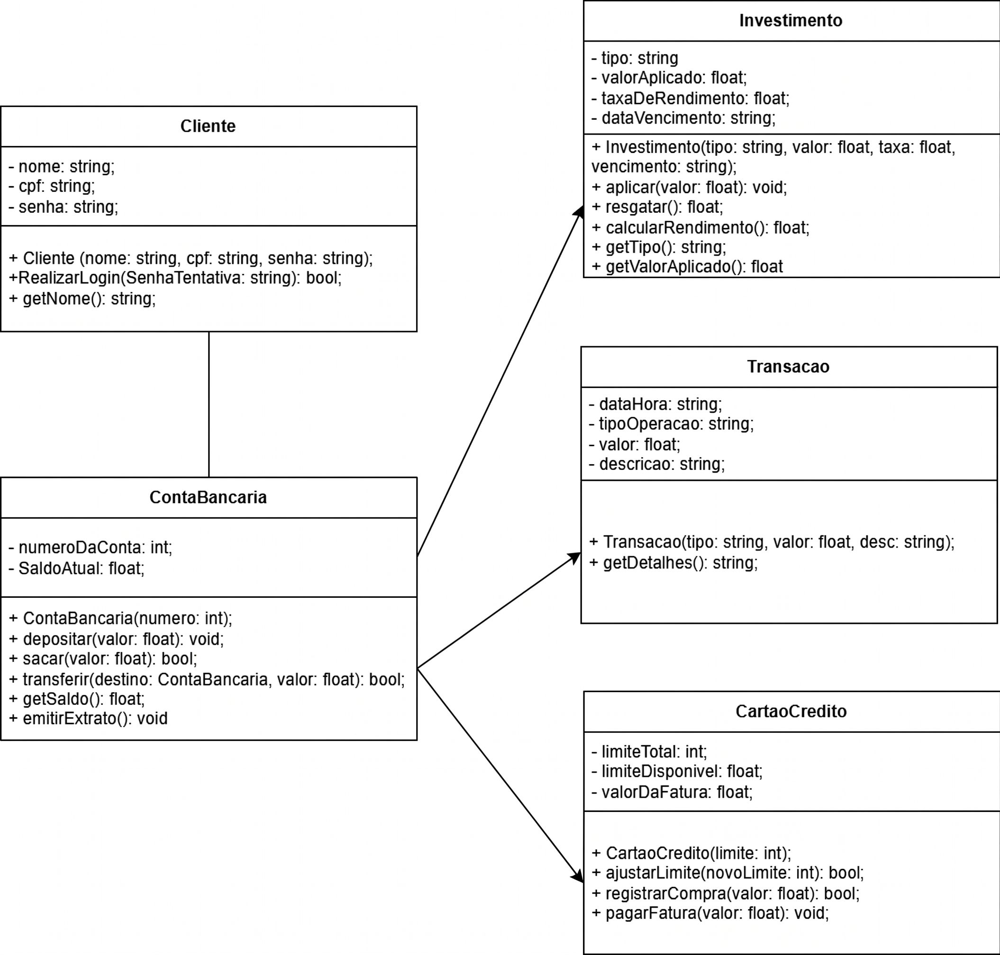

## Descrição Geral do domínio do problema

O sistema proposto visa simular um aplicativo de investimentos. Com uma interface simplificada e minimalista.
O intuito do programa é organizar e gerir os investimentos do usuário de uma maneira fácil e intuitiva. É possível adicionar novos ativos, adicionar ativos já comprados anteriormente, remover/vender ativios e acompanhar o lucro consolidado do ativo.

## Requisitos funcionais 
01 - Cadastro do investidor;

02 - Autenticação do investidor;

03 - Dashboard principal (visão consolidada da carteira);

04 - Compra de novos ativos (aportes);

05 - Venda de ativos;

06 - Logout na sessão;

## Requisitos não funcionais
Requisitos não funcionais

01 - Código será escrito em C++;

02 - Interface minimalista e simples, desenvolvida no QT;

03 - Informações devem ser armazenadas em um .TXT;

04 - Código deve garantir segurança na autenticação;

05 - Arquitetura em POO;
## Diagrama de Casos de Uso

O Diagrama de Casos de Uso a seguir foi elaborado com o objetivo de mapear as interações essenciais entre o investidor e o gerenciador de investimentos, delimitando o escopo funcional da aplicação. A modelagem abaixo foca somente nas interações realizadas pelo investidor, abstraindo banco de dados.
Para representar adequadamente o controle de acesso e garantir a segurança do sistema , o diagrama adota a separação de papéis através de dois atores principais:

## - Visitante:
Representa o estado inicial do usuário no aplicativo, onde o visitante deve obrigatoriamente se cadastrar ou realizar o login para interagir com o APP, caso contrário, não terá qualquer permissão ou acesso no APP.

## - Investidor: 
Representa o usuário que já passou pelo processo de autenticação, ou através de um novo registro, ou um login com uma conta já existente. Esse ator possui acesso completo a aplicação, simula um usário que já utiliza o programa.

## Especificação do caso de uso da etapa "Fazer Login"
- Ator principal: Visitante;
- Objetivo: Autenticar o ator visitante para liberar acesso completo a carteira de investimentos;
- Condição: Ator deve estar na tela inicial e já ter cadastrado no aplicativo pelo menos uma vez;

1 - Visitante acessa a tela de login;

2- Visitante insere os dados (CPF e senha) e clica em Entrar;

3- Sistema verifica no .TXT em busca de dados de usuário;

4- Faz um check-up no .TXT pra ver se está de acordo;

5- Caso os dados estiverem de acordo, o login é bem-sucedido;

6- Ator visitante vira Ator investidor;

7- Ator investidor tem acesso total a aplicação.
 
## Diagrama de Domínio do problema

O Diagrama de Classes a seguir representa a estrutura do gerenciador de investimnetos. Ele serve como o "esqueleto" do código C++, definindo as classes que farão o sistema funcionar, seus atributos e seus métodos.

O diagrama abaixo é dividido por atributos privados e métodos públicos.

Relação de hierarquia entre Usuário e investidor;

A relação entre Investidor e Investimento é uma composição de 1 pra N (1...*)

[Retroceder](README.md) | [Avançar](projeto.md)

